# IoT-uni-NXT

A universal dongle for UART-controlled IoT appliances, designed around the [Seeed Studio XIAO ESP32 form factor](https://www.seeedstudio.com/ESP32-Series-c-2580.html?sensecap_affiliate=y1Qg8fB&referring_service=link).

This is a fork of [dudanov/iot-uni-dongle](https://github.com/dudanov/iot-uni-dongle) by [Sergey Dudanov](https://github.com/dudanov), who designed the original board and did the reverse-engineering work behind the [MideaUART](https://github.com/dudanov/MideaUART) protocol that this project (and its ESPHome `midea` climate component) relies on. All credit for the original concept goes to him.

## Why this fork exists

The original design uses an [ESP12-F](https://docs.ai-thinker.com/_media/esp8266/docs/esp-12f_product_specification_en.pdf) module (ESP8266). It's a proven, inexpensive, and reliable choice, but it's also over a decade old at this point. Single core, no Bluetooth, limited RAM, and no way to run modern [ESPHome](https://esphome.io) features that need more headroom.

This fork replaces it with a Seeed Studio XIAO ESP32 module because it offers better performance, newer Wi-Fi standards, Bluetooth, significantly more RAM or PSRAM, and enough headroom to run ESPHome's `bluetooth_proxy`, or presence-detection setups like [Bermuda BLE Trilateration](https://github.com/agittins/bermuda) or [TOMMY presence tracking](https://www.tommysense.com/) alongside the AC control.

Air conditioners are powered 24/7, even when they are not actively cooling or heating, which makes the inside of an AC unit's control compartment an excellent, physically hidden location for an always-on ESP32 node. This effectively gives you a Bluetooth proxy or presence-tracking node in the room "for free", on hardware that's already there for another reason.

## Supported ESP32 variants

The IoT-uni-NXT PCB can be assembled with a [XIAO ESP32-C3](https://www.seeedstudio.com/Seeed-XIAO-ESP32C3-p-5431.html?sensecap_affiliate=y1Qg8fB&referring_service=link), [XIAO ESP32-C5](https://www.seeedstudio.com/Seeed-Studio-XIAO-ESP32C5-p-6609.html?sensecap_affiliate=y1Qg8fB&referring_service=link), [XIAO ESP32-C6](https://www.seeedstudio.com/Seeed-Studio-XIAO-ESP32C6-p-5884.html?sensecap_affiliate=y1Qg8fB&referring_service=link) or [XIAO ESP32-S3](https://www.seeedstudio.com/XIAO-ESP32S3-p-5627.html?sensecap_affiliate=y1Qg8fB&referring_service=link). The only hardware change is the XIAO module you solder onto the board. In ESPHome use the matching board-specific template file from this repository: `template-xiao-c5.yaml`, `template-xiao-c3.yaml`, `template-xiao-c6.yaml`, or `template-xiao-s3.yaml`.

See [Board variants](board-variants.md) for a comparison of the supported XIAO ESP32 modules.

## Main goals

1. A unified design for UART-controlled devices from different manufacturers.
2. Support for 2.54 mm-pitch connectors (like USB-A).
3. Configurable TX/RX pin order on the UART connector.
4. IR transmission and reception.
5. Minimal design, built specifically around the XIAO form factor.
6. Support for multiple XIAO ESP32 modules depending on user preference.

[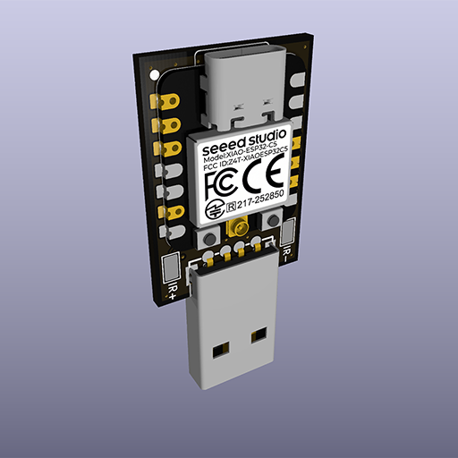](images/assembled-front.png) [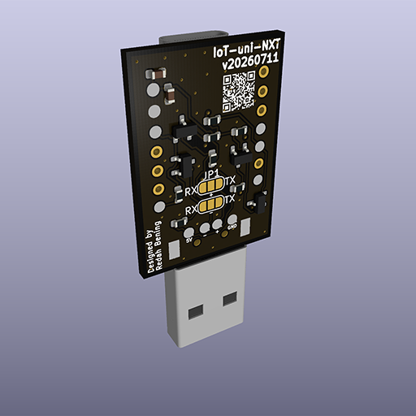](images/assembled-back.png)

A non-exhaustive list of supported brands:
1. [Midea](https://www.midea.com)
2. [Electrolux](https://www.electrolux.com)
3. [Qlima](https://www.qlima.com)
4. [Artel](https://www.artelgroup.com)
5. [Carrier](https://www.carrier.com)
6. [Comfee](https://www.feelcomfee.com)
7. [Inventor](https://www.inventorairconditioner.com)
8. [Dimstal/Simando](https://www.simando24.de)

## Connector mounting examples

[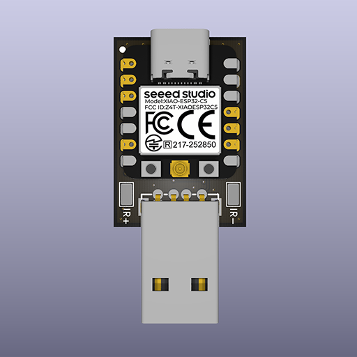](images/connector-usba.png) [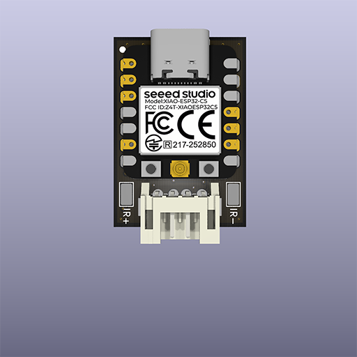](images/connector-jst.png) [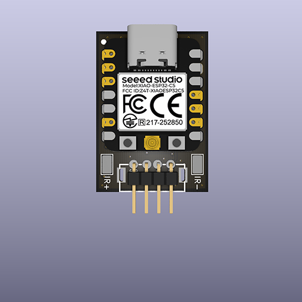](images/connector-pinheader.png)

## TX/RX signal routing

To choose the TX/RX pin order, bridge the appropriate solder jumpers:

[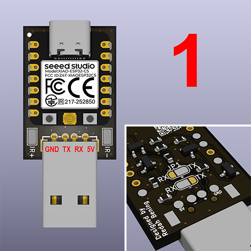](images/rxtx-midea.png) [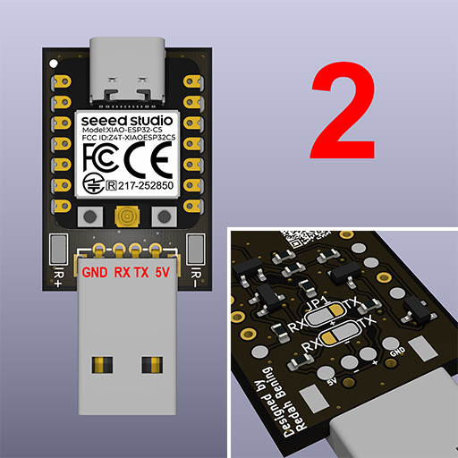](images/rxtx-haier.png)

## Sending and receiving IR remote control commands

Because the UART protocol does not expose all AC features (e.g. display control and the `FollowMe` feature), the board also supports sending IR commands by feeding a demodulated IR signal without carrier modulation to a dedicated GPIO on the ESP32.
To do this, connect the `IR+` pad on the bottom side of the board to the input of the TSOP IR receiver/demodulator on the AC board.
The pictures below show an example for a TSOP1738 IR receiver.

[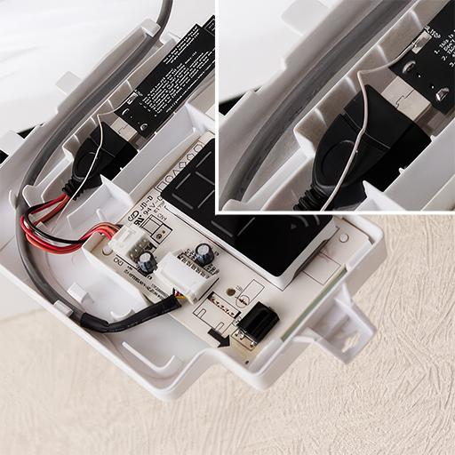](images/tsop-dongle.png) [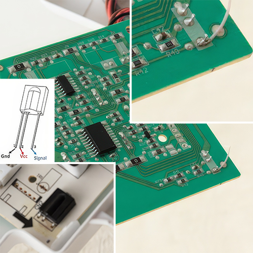](images/tsop-display.png)

The design also supports reading the IR signal from any remote control (including third-party ones) on a separate GPIO, through its own level shifter. This can help with protocol research and other automation tasks without resorting to additional devices.

## SMT assembly on JLCPCB

The [single-smt](jlcpcb/single-smt) directory contains the files required to manufacture and assemble the board at [JLCPCB](https://jlcpcb.com).

The boards you receive from JLCPCB will look like this:

[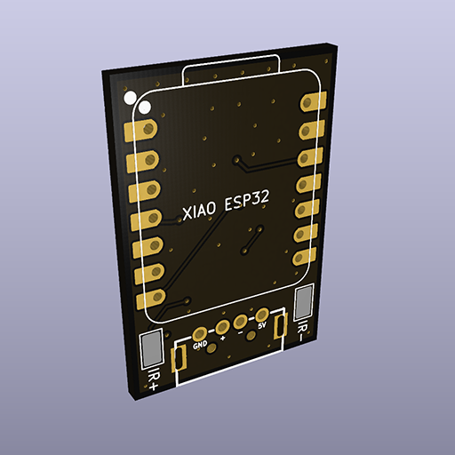](images/factory-front.png) [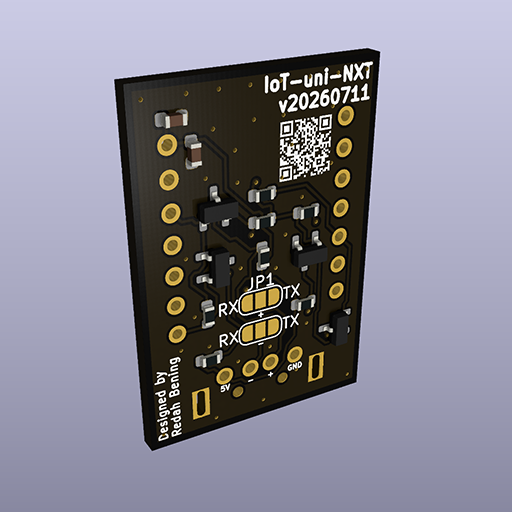](images/factory-back.png)

After delivery solder the selected XIAO module and the required connector to the back of the board, then configure the TX/RX pin order for your device. Use the matching `template-xiao-XX.yaml` ESPHome template for the XIAO module you installed.

## ESPHome configuration

Example ESPHome templates are included for the supported XIAO ESP32 variants:

* `template-xiao-c3.yaml`
* `template-xiao-c5.yaml`
* `template-xiao-c6.yaml`
* `template-xiao-s3.yaml`

Use the template that matches the XIAO module soldered to your board. The templates contain the required ESPHome configuration for UART-based AC control, plus optional commented blocks for extra features such as IR transmission, IR reception, FollowMe, display control, and swing control.

For a step-by-step explanation of the YAML configuration and what each section does, see [ESPHome configuration](esphome.md).

## Flashing

Use the ESPHome template that matches your XIAO board. The first installation is performed through the USB-C connector on the XIAO; later updates can normally be installed wirelessly via OTA.

See [Flashing the IoT-uni-NXT](flashing.md) for complete step-by-step instructions.